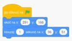

# 2020/2021

Kurz **Programování na Nuselské** bude probíhat od října 2020
a navazuje na kurz **začátečníci**. Je určen pro děti druhých
a třetích tříd s tím, že děti druhých tříd musí mít absolvovaný
kurz začátečníci, šikovní jedinci z řad třetích tříd mohou
přijít i bez předchozího vzdělání.

Cílem tohoto kurzu je pokračování v rozvoji systematického
myšlení, hlubší poznávání světa informační techniky
a osvojení si základů elektrotechniky.

Kurz bude probíhat 1x týdně, každý čtvrtek od 15:05 v počítačové
učebně.

V kurzu budeme využívat robůtky [Cubetto](https://www.primotoys.com),
[Beebot](https://www.bee-bot.us/) i [Ozobot](https://ozobot.com/).
Později si představíme platformu [Micro:bit](https://microbit.org)
a s ní zabředneme trochu blíže k elektrotechnice. Kromě těchto
se budeme věnovat i práci na PC, kde se budeme učit programovat
pomocí vybraných kurzů na [code.org](https://www.code.org),
prostředí [scratch](https://scratch.mit.edu/) a dalších.
To vše proložíme tvůrčími aktivitami s papírem, kostkami a jinými
rekvizitami.

Cílem kurzu není vzdělat hotového programátora, ale rozvíjet logické
myšlení, algoritmizaci a jiné vlastnosti, které se dětem budou hodit
při studiu jakéhokoliv oboru.

Kurz bude organizován a veden [Lukášem Doktorem](../../lectors/ldoktor.md)

## 1. hodina

* Seznámení s lektorem a ostatními spolužáky
* Přihlášení k počítačům - drobné technické potíže
* Stránky www.code.org
  * Nastavení účtu
  * Programování na papíru (tabuli)
* Demonstrace pomůcek
  * Beebot
  * Ozobot
  * Micro:bit + příslušenství

## 2. hodina

* Beeboti
  * seznámení
  * základy pohybu po mapě
  * opakovaný pohyb
* www.code.org
  * 3 - Angry birds bludiště

## 3. hodina

* Videokonference [návod na připojení](../../media/jitsi-navod.mp4)
  * Dokončení lekce 3 - Bludiště
  * Uvedení do lekce 4 - Umělec
    * Vždy čtěte zadání
    * Nezapomeňte využívat nápovědy (žárovka nalevo od textu zadání)
    * Pixely jsou čtverečky, ze kterých se skládá obraz
    * Otáčíme se o úhel udávaný ve stupních, 90° je pravý úhel a odpovídá našemu "otočení se" v předchozí lekci. Bližší info <a href="https://www.slideserve.com/trang/m-en-hl">zde</a>
  * V rámci možností mohou děti samostatně pokračovat v umělcovi
    * Když něco nepůjde, doporučuji pauzu a zkusit to druhý den (či později)
    * Když se i tak nebude dařit, je možné přeskočit úroveň
    * Rodiče by neměli pomáhat
  * Příště vyjasníme případné nesrovnalosti, dokončíme umělce a začneme cykly

## 4. hodina

* Videokonference [návod na připojení](../../media/jitsi-navod.mp4)
  * Dokončení lekce 4 - Umělec
    * Opakuji, nezapomeňte číst zadání a případně použít nápovědu (žárovka nalevo od textu zadání)
  * Lehký úvod do cyklů/opakování
  * Domácí úkol:
    * Všímejte si, kde se v okolním světě vyskytuje či dá využít opakování (např. dlaždičky, plot, hudba, ...)
    * Pročtěte a porovnejte jednotlivá zadání z [[pdf](pokrocili-1-04-peceni.pdf), [odt](pokrocili-1-04-peceni.odt)]
    * Opravite "Pseudo-kód pro počítač" v receptu [[pdf](pokrocili-1-04-peceni.pdf), [odt](pokrocili-1-04-peceni.odt)] za pomocí opakování, viz. ukázka v prvních dvou krocích.
    * Volitelně se můžete pokusit dort upéci. Který návod Vám vyhovoval nejvíce?

## 5. hodina

* Videokonference [návod na připojení](../../media/jitsi-navod.mp4)
  * Řešení k domácímu úkolu [[pdf](pokrocili-1-05-peceni-reseni.pdf), [odt](pokrocili-1-05-peceni-reseni.odt)]
    * Doporučuji projít s dětmi, je důležité uvědomit si rozdíl mezi opakováním jedné instrukce a opakování sledu několika instrukcí
  * www.code.org - lekce 6 - Bludiště cykly
    * Jednoduchá opakování, opakování sledu instrukcí/bločků a kombinace
    * Doporučuji projít si všechny úrovně z této lekce a pokusit se dotáhnout je do kompletního řešení. To poznáme tmavě zelenou barvou oproti světle zelené která funguje, ale není optimální.
  * Domácí úkol:
    * Procvičovat cykly/opakování ať už v reálném světě (vaření, kutění, skládání z lega, ...), tak v lekci 6 na code.org. Začátky jsou těžké, ale postupně by mělo vše začít do sebe zapadat.

## 6. hodina

* www.code.org
  * Procvičování lekce 6 - Bludiště cykly
  * Zkoušení úrovní z www.code.org se včelkami, cyklování pomocí opakovaného spouštění
* Seznámení s prostředím Scratch
  * Odkaz na editor <a href="https://scratch.mit.edu/projects/editor/">zde</a>
    * Vlevo nahoře přepínání *Scénáře*, *Kostýmy* a *Zvuky*
    * Po levé straně *skupiny funkčních bločků*, vedle jednotlivé *bločky*
    * Uprostřed *kód* aktuálně vybrané postavy
    * V pravo nahoře *náhled programu*
    * V pravo dole výběr jednotlivých *postav* a *scény*
  * Veškerý kód musí někde začínat, k tomu slouží bločky *Události*
  * Jednoduchá ukázka rozpohybované kočičky <a href="https://scratch.mit.edu/projects/457640049/editor/">zde</a>

## 7. hodina

* <a href="https://scratch.mit.edu/projects/editor/">Scratch</a>
  * Příprava betlému
    * Vkládání spritů ze souboru (najet myší a vybrat tlačítko "nahrát postavu")
    * Rozpohybování objektu pomocí několika spritů (další kostým)
    * Posun objektů (skoč na, klouzej na)

## 8. hodina

* <a href="https://scratch.mit.edu/projects/editor/">Scratch</a>
  * Vylepšování betlému v programu <a href="https://scratch.mit.edu/projects/editor/">Scratch</a>
  * Ukázky vybraných kódů pro inspiraci [zde](pokrocili-1-08-betlem-kod.png)
  * Ukázkové řešení <a href="https://scratch.mit.edu/projects/461706147/">zde</a>, doporučuji prostudovat, upravit a můžete se na příští hodině pochlubit.

## 9. hodina

* Videokonference [návod na připojení](../../media/jitsi-navod.mp4)
  * <a href="https://robomise.cz">https://robomise.cz</a>
    * Kvůli stávkujícím serverům Scratche jsme si udělali krátkou odbočku a vyzkoušeli jsme robomisi
    * Děti si mohou vyzkoušet všechny úrovně až po "L3 - Ukliď si cestu"
    * Úroveň L4 obsahuje podmínky, které budeme probírat až později

## 10. hodina

* Videokonference [návod na připojení](../../media/jitsi-navod.mp4)
  * <a href="https://scratch.mit.edu/projects/editor/">Scratch</a> - hra "chytni kočku"
    * Návod pro osvěžení si paměti ve formátech: [pdf](pokrocili-1-10-kocka.pdf) či [odt](pokrocili-1-10-kocka.odt)
    * <a href="https://scratch.mit.edu/projects/470669556/">Odkaz na vytvořenou hru</a>

## 11. hodina

* Videokonference [návod na připojení](../../media/jitsi-navod.mp4)
  * <a href="https://scratch.mit.edu/projects/editor/">Scratch</a> - hra "chytání padajícího ovoce I."
    * Návod pro osvěžení si paměti ve formátech: [pdf](pokrocili-2-01-chytani-ovoce-v2.pdf) či [odt](pokrocili-2-01-chytani-ovoce-v2.odt)
    * Stihli jsme jednoduchý pohyb vlevo a vpravo s pohybem spritu a generování ovoce náhodně po celé ploše
    * <a href="https://scratch.mit.edu/projects/441005609/">Odkaz na vytvořenou hru</a>
    * <a href="https://scratch.mit.edu/projects/492123452/">Odkaz na námi vytvořenou část 1</a>

## 12. hodina

* Videokonference [návod na připojení](../../media/jitsi-navod.mp4)
  * <a href="https://scratch.mit.edu/projects/editor/">Scratch</a> - hra "chytání padajícího ovoce II."
    * Návod pro osvěžení si paměti ve formátech: [pdf](pokrocili-2-01-chytani-ovoce-v2.pdf) či [odt](pokrocili-2-01-chytani-ovoce-v2.odt)
    * Přidali jsme si další kostýmy a využili jsme bloček "náhodné číslo od XXX do YYY" abychom náhodně měnili kostýmy.
    * Naučili jsme ovoce padat. Gravitaci jsme implementovali pomocí nekonečného cyklu "změň Y o -3".
    * Poté jsme opět využili "náhodné číslo od XXX do YYY" abychom generovali na náhodných pozicích ale pouze v horní části obrazovky.
    * Nakonec jsme se vrhnuli do podmínek. Naučili jsme panáčka ovoce chytat a také jsme si nadefinovali, co se stane, pokud ovoce spadne na zem.
    * <a href="https://scratch.mit.edu/projects/441005609/">Odkaz na vytvořenou hru</a>
    * <a href="https://scratch.mit.edu/projects/493011380/">Odkaz na námi vytvořenou část 2</a>

## 13. hodina

* Videokonference [návod na připojení](../../media/jitsi-navod.mp4)
  * <a href="https://scratch.mit.edu/projects/editor/">Scratch</a> - hra "chytání padajícího ovoce III."
    * Znovu jsme si prošli kód, podmínky jsou prostě fuška
    * Přidali jsme do hry zvuky při chycení a pádu ovoce (ach ty podmínky)
    * Nahradili jsme ovládání pomocí událostí takzvaným "pollingem", čili smyčkou neustále kontrolující stav stisknutí kláves
      * Rozdíl je při podržení klávesy kde ovládání pomocí události (tlačítka "a" a "d") posune panáčka a následuje krátká pauza a teprve potom se panáček rozběhne. V poll módu kdykoliv je klávesa držena panáček utíká a s jejím uvolněním okamžitě zastavuje.
      * Opět jde o demonstraci podmínek
    * Nestihli jsme dodělat podmínky pro ukončení hry, ale domluvili jsme se na krátké pauze od Scratche, proto přikládám ukázku, která tyto podmínky obsahuje. Doporučuji projít, pohrát si a případně poupravit doma.
    * <a href="https://scratch.mit.edu/projects/441005609/">Odkaz na vytvořenou hru</a>
    * <a href="https://scratch.mit.edu/projects/493011380/">Odkaz na námi vytvořenou část 2</a>
    * <a href="https://scratch.mit.edu/projects/499965964/">Odkaz na námi vytvořenou část 3 (včetně podmínek pro konec hry)</a>

## 14. hodina

* Videokonference [návod na připojení](../../media/jitsi-navod.mp4)
  * <a href="https://codecombat.com/play/dungeon">Code Combat</a>
    * Registrace do studentského účtu bez emailu (možno hrát bez uložení bez registrace)
    * Vysvětlení prostředí:
      * panel hry
      * panel metod
      * panel kódu
      * tlačítko nápověda
      * tlačítka na spuštění
    * Programování textově v Pythonu
      * Vykonávání po řádcích
      * objekt `hero` je náš hrdina
      * `hero.PŘÍKAZ()` - řekne hrdinovy aby vykonal `PŘÍKAZ`
      * `hero.PŘÍKAZ(1)` - řekne hrdinovi aby vykonal `PŘÍKAZ` s parametrem `1`
      * seznam příkazů <a href="pokrocili-2-04-codecombat-prikazy.jpg">zde</a>
    * Slovníček
      * hero - hrdina
      * move - posuň se/jdi
      * up - nahoru
      * down - dolu
      * left - doleva
      * right - doprava
      * say - řekni
      * attack - zaútoč
    * Procházení vlastním tempem - 3 - 7 úroveň
    * POZOR na překlepy, neplatný kód je označen červeně

## 15. hodina

* Videokonference [návod na připojení](../../media/talky-navod.mp4)
  * <a href="https://codecombat.com/play/dungeon">Code Combat</a>
    * Pokračování z minula
    * seznam příkazů <a href="pokrocili-2-04-codecombat-prikazy.jpg">zde</a>
    * pozor na mezery, velikost písmen a překlepy, v Pythonu jsou důležité

## 16. hodina

* Videokonference [návod na připojení](../../media/talky-navod.mp4)
  * Na oživení jsme se pokusili projít minovým polem
    * zadání ve formátech: <a href="pokrocili-2-06-miny.ods">ods</a>, <a href="pokrocili-2-06-miny.xlsx">xlsx</a> a <a href="pokrocili-2-06-miny.pdf">pdf</a>
    * <a href="pokrocili-2-06-miny-reseni.pdf">ukázkové řešení</a>
  * <a href="https://codecombat.com/play/dungeon">Code Combat</a>
    * Pokračování z minula (kola 3 - 14)
    * Největší problém je přihlašování :-(

## 17. hodina

* Videokonference [návod na připojení](../../media/talky-navod.mp4)
  * <a href="https://codecombat.com/play/dungeon">Code Combat</a>
    * Pokračování z minula (kola 3 - 15)
    * Zakončení látky, děti si mohou pokračovat dle libosti doma
  * Jako nastínění další látky jsme si vysvětlili, jak fungoval trik s <a href="pokrocili-2-07-kouzlo-hulka.jpg">kouzelnou hůlkou</a>. O detekci energie opravdu nešlo, vše zajišťovala dvojice Micro:bitů. Na kód se můžete podívat zde: <a href="https://makecode.microbit.org/_hmpUktPEw5ee">vysílače</a> a <a href="https://makecode.microbit.org/_TodHPk1ChTtq">přijímač</a>

## 18. hodina

* Rozebírání počítače
  * Počítač, monitor a klávesnice
  * Co je to:
    * Základní deska
    * Zdroj
    * Procesor
    * Paměť RAM
    * Grafická karta
    * Pevný disk
  * Jak spustit počítač bez bedny/tlačítka?
  * Co se stane, když sundám chladič z (modernějšího) procesoru?

## 19. hodina

* Hra na procesor
  * Na diagramu procesoru MP-4 jsme si ukázali, jak funguje jednoduchý procesor. Schéma + ukázkový program jsou k dispozici ve formátech: <a href="../assets/processor.ods">ods</a> a <a href="../assets/processor.pdf">pdf</a>
  * Princip:
    * Po spuštění je vše kromě Paměti **ROM** vynulováno, v Paměti **ROM** je kód z materiálů ze stránky 2
    * Programový čítač **PC** nastaví adresu Paměti ROM na 00
    * Řadič **Control** přečte instrukci (první číslo z paměti) z nastavené adresy a dle instrukce řídí posloupnost mikroinstrukcí:
      * LDA - Načte operand (druhé číslo z paměti) a přes sběrnici **Bus** a Aritmeticko-logickou jednotku **ALU** jej uloží do Akumulátoru **Acc**
      * ADD - Načte operand (druhé číslo z paměti) a přes sběrnici **Bus** jej pošle do Aritmeticko-logickou jednotku **ALU** která přište toto číslo k číslu uloženému v Akumulátoru **Acc**. Výsledek uloži opět do Akumulátoru **Acc**
      * JMP2, n - Pokud je v Akumulátoru **Acc** hodnota 0, změní obsah Programového čítače **PC** na hodnotu operandu (druhé číslo z paměti)
    * Až na výjimky je inkrementován Programový čátač **PC**, čímž se změní adresa Paměti ROM a vše pokračuje do přerušení proudu či do vykonání instrukce HLT (Halt - stop)
  * Pro výstup jsme uvažovali, že na výstupním portu A je připojena jednoduchá tiskárna, která kazdý výstup detekuje, dekóduje pomocí ASCII tabulky a zapíše.
  * **HELLO WORLD** == "Ahoj světe". Tato věta se často používá pro demonstraci základní syntaxe programovacího jazyku. Více informací <a href="https://cs.wikipedia.org/wiki/Hello_world">na Wikipedii</a>

## 20. hodina

* <a href="https://www.microbit.org">Micro:bit</a>
  * Co to je Micro:bit (bbc, bit, microbit, co vše má destička na sobě, ...)
  * Seznámení s programovacím interfacem <a href="https://makecode.microbit.org/">https://makecode.microbit.org/</a>
  * Postup nahrání projektu na Micro:bit (**stáhnout**; **zrušit**; pravé tlačítko myši na **stáhnout znovu**; **uložit odkaz jako...**; vybrat disk **MICROBIT**; **uložit**)
* Funkce laserové tiskárny
  * Princip funkce laserové tiskárny (4xtoner, skleněný válec který laser lokálně nabije statickou elektřinou, prášek se uchytí a vytvoří zrcadlový obraz, obtiskne se na papír, papír se zažehlí při teplotě cca 200°C)
  * Rozborka tiskárny HP Color LaserJet 5M (základní deska s procesorem a pamětí, rozšiřující deska JetDirect, display, pohyb v menu a spousta koleček)

# 21. hodina

* <a href="https://trachtenbergspeedmath.com/">Trachtenberg - rychlé sčítání</a>
  * Ukázka, k čemu jsou vhodné počítače - účetnictví
  * Demonstrace volby algoritmu
    * Prostý součet v podstatě nemožný, mnoho mezivýpočtů a v podstatě jistá chyba
    * Trachtenberg - rychlé sčítání - rychlé a jednoduché - vždy počátáme jen do cca 20, složitost je lineární pro jakýkoliv počet i řád sčítaných čísel
* <a href="https://www.microbit.org">Micro:bit</a>
  * Čítač stisků tlačítka A
  * Úprava na počet skoků

# 22. hodina

* <a href="https://trachtenbergspeedmath.com/">Trachtenberg - rychlé sčítání</a>
  * Ukázka lehké kontroly pomocí zástupných čísel (český návod [pdf](trachtenberg.pdf)/[ods](trachtenberg.ods))
    * lze použít pro jakýkoliv příklad (sčítání, odčítání, násobení, dělení, ...) ``12 * 14 = 168``
    * každé číslo nahradím jeho jednomístným ciferným součtem  ``12=>3; 14=>5; 168=>15=>6``
    * vypočítám příklad s těmito zástupnými čísli, obě strany musí vyjít stejně ``3 * 5 = 15=>6; 6 == 6``
    * vše funguje proto, že ciferný součet udává zbytek po dělení 9. Neodhalí všechny chyby, ale je to lehká kontrola na odhalení základních chyb
* <a href="https://www.microbit.org">Micro:bit</a>
  * Tvorba kostky, abychom si mohli zahrát pexeso
  * "Vylepšení" kostky, abychom mohli vyhrát pexeso (podvádění)

# 23. hodina

* <a href="https://trachtenbergspeedmath.com/">Trachtenberg - násobení čísel blížící se 10 a 100</a>
  * Český návod [pdf](trachtenberg.pdf)/[ods](trachtenberg.ods)
* [Domácí úkol](pokrocili-2-13-domaci-ukol.pdf)
  * Opáčko Trachtenbergova rychlého sčítání
  * Opáčko Trachtenbergovy metody násobení čísel okolo 10 a 100
  * Jednoduché šifrování
  * Programování Micro:bit na papíře

# 24. a 25. (dvou) hodina

* <a href="https://www.openttd.org/">Open TTD</a>
  * Hra Open TTD je open-source re-implementací stařičké dosové hry "Transport Tycoon Deluxe" z roku 1994. Jedná se o simulaci ekonomiky z pozice dopravního magnáta. Je velmi komplexní, naučí děti základy ekonomiky, počítání a hlavně plánování. Signály pro řízení vlaků lze využít k výuce parallelizace a navíc lze do hry dodat vlastní doplňky, které si děti mohou samy vyvinout.
  * Stažení je možné zdarma ze stránek <a href="https://www.openttd.org/downloads/openttd-releases/latest.html">OpenTTD</a>, případně na Steamu. A ke hře existuje pěkný popis <a href="https://wiki.openttd.org/cs/Manual/">formou wiki stránek částečně v češtině</a>
  * Po instalaci doporučuji v "možnosti hry"
    * Nastavit rozlišení obrazovky a zakliknout "na celou obrazovku"
    * Měnu CZK
    * Pro moderní jemné displaye doporučuji nastavit "Velikost rozhraní" na dvojnásobné (či čtyřnásobné)
  * V "nastavení" pak:
    * Překliknout "Kategorie - základní" na "Expertní" (čímž se zpřístupní další volby). Dále pak pomocí vyhledávání vyhledat následující volby (zpravidla stačí napsat několik prvních písmen)
    * "Vyznačovat rezervovanou trať" - ano
    * "Výchozí typ návěstidla" - dokonalejší PBS
    * "Zavírat okno pravým tlačítkem myši" - ano
    * "Zakázat otáčení vlaků ve stanicích" - ne
    * "Zakázat vlakům otáčení o 90 stupňů" - ne
  * Dále pak v "Stahování součástí" dát hledat a stáhnout (cca 1GB):
    * "CZTR" (všechny položky - české vlaky/autobusy/prostředí)
    * "OpenSFX" (zvuky)
    * "OpenMSX" (hudba)
    * "Polish building set" - městské budovy podobné našim
  * Tyto stažené grafiky je nutno aktivovat v "nastavení grafik". Stačí poklikat na všechny položky v dolním menu, čímž se přesunou nahoru a aktivují se.
  * Pro výuku toku nákladů můžete použít [diagram toků nákladů](pokrocili-2-14-openttd-diagram-nakladu.pdf) a vyzkoušet si pospojovat veškerý průmysl na [naší výukové mapě](pokrocili-2-14-openttd-mapa.scn). Inspiraci do začátku můžete čerpat z následujícího [obrázku](pokrocili-2-14-openttd-screenshot.jpg). Pokud byste měli problém s penězi, můžete použít kódy pomocí ``ctrl+alt+c``.
  * Pohyb po ploše je možný šipkamy či myší držením pravého tlačítka
  * Kliknutím pravým tlačítkem kamkoliv na okno jej zavřete
  * Pro dopravu je vždy potřeba postavit několik stanic/zastávek/letišť, koupit dopravní prostředek, nastavit trasu (šipka v pravo) a vypustit vozidlo (vlaječkou či tlačítko vespod dialogu vozidla)
  * Letadla se kupují v hangáru na letišti (nutno klikat a hledat)
  * Lodě se kupují v lodním depu a mola jsou univerzální
  * Autobusy/náklaďáky se kupují v depu, které je nutno postavit. Dále se dělí zastávky na autobusové a nákladní.
  * Vlakové stanice musí být delší, než nejdelší vlak (jinak bude nakládání trvat neúměrně dlouhou dobu). Doporučuji 5 či 6. Počet platform v ohromných městech 8, velkých městech 4, malých 2-3 a před a za vždy umístit "obousměrný dokonalejší PBS návěstidlo" ve směru ze stanice (vícenásobným klikáním se návěstidlo otočí). Pozor na příliš ostré zatáčky.
  * Na youtube lze nalézt mnoho návodů, jak na hru.
    * <a href="https://www.youtube.com/watch?v=U8JFf99d-b4">Úplné základy</a>
    * <a href="https://www.youtube.com/watch?v=07LFnqGqSXs&list=PLrd3MXH-BxoPAZNKKmFyFdv7ZCMcwxNLL">Pokročilejší témata</a>
    * <a href="https://www.youtube.com/watch?v=tQX5A0OzmX0&list=PLZ4ZL2Bf97rK6xbZOR85ux1IKn6imNm_S">Úžasná ukázka jak stavět realisticky železnici</a>
* Na závěr ukázka Micro:bit autíčka z krabičky od bonboniéry (snad postavíme příští rok)

